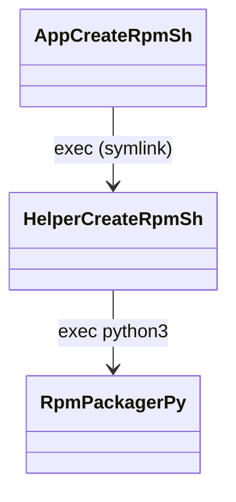
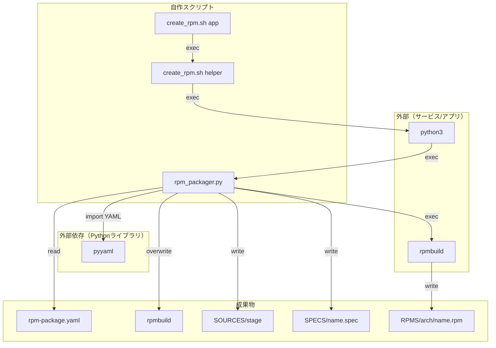

# RPM 作成ツール（RpmCreateTool）

このドキュメントは、`Shared/Helper/RpmCreateTool` 配下の「事前ビルド済み成果物を RPM に固める」ツールについて、

- スクリプト間の依存関係（どれがどれを呼ぶか）
- 生成物（どこに何が出るか）
- `rpm-package.yaml` の書き方

をまとめます。

## 目的

- アプリのビルド成果物（例: `build/` 配下のバイナリ）やヘッダを、設定ファイルの宣言どおりに RPM に梱包する
- アプリごとの差分は `rpm-package.yaml` に閉じ込め、ツール本体は共通化する

## スクリプト依存（exec のみ）

アプリ側は `create_rpm.sh` を 1 つ置き（シンボリックリンク推奨）、それを叩くと Python ツールが起動します。



対応する実体:

- アプリ側: `Shared/Applications/<app>/create_rpm.sh`（`Shared/Helper/RpmCreateTool/create_rpm.sh` へのシンボリックリンク）
- 共通スクリプト: `Shared/Helper/RpmCreateTool/create_rpm.sh`
- パッケージャ本体: `Shared/Helper/RpmCreateTool/rpm_packager.py`

## 依存関係（成果物/外部依存まで含める）

ツールが参照する入力、生成する成果物、外部コマンド/ライブラリを含めた関係図です。



重要な挙動:

- `create_rpm.sh`（helper側）は「呼び出し元（アプリ側の `create_rpm.sh` が置かれているディレクトリ）」を作業ディレクトリとして扱います。
  - これにより、どこから実行しても `rpm-package.yaml` をアプリ直下に置けば `./create_rpm.sh` だけで動きます。
- `rpmbuild/` は毎回作り直します（既存の `rpmbuild/` は上書き/削除されます）。

## 使い方

アプリのディレクトリ（`rpm-package.yaml` がある場所）で実行します。

```bash
./create_rpm.sh
```

`rpmbuild` を呼ばずに、ステージングと spec 生成だけ確認したい場合:

```bash
./create_rpm.sh --no-rpmbuild
```

出力先:

- `rpmbuild/RPMS/*/*.rpm`

## rpm-package.yaml の書き方

`rpm-package.(yaml|yml|json)` は「RPMのメタ情報」と「梱包対象ファイル」を宣言します。
このツールはデフォルトで、カレントディレクトリから次を探索します。

- `rpm-package.yaml`
- `rpm-package.yml`
- `rpm-package.json`

### package（メタ情報）

必須キー:

- `package.name`: パッケージ名（例: `google-test-app`）
- `package.version`: バージョン
- `package.release`: リリース番号（文字列でOK）
- `package.summary`: サマリ
- `package.license`: ライセンス表記

任意キー:

- `package.url`: URL（空文字でも可）
- `package.description`: 説明（省略時は `summary` が使われます）
- `package.arch`: `BuildArch` を指定したい場合（例: `aarch64`, `x86_64`）

### files（梱包対象）

`files` は配列で、各要素が1つの「インストール項目」です。

共通ルール:

- `mode` は文字列で `"0755"` / `"0644"` のように指定します（未指定時は `0644`）
- `dest` / `dest_dir` / `dest_dir` は必ず `/` から始まる絶対パスです（RPM内のインストール先）
- `src` / `src_dir` は「アプリのディレクトリ（実行時に参照される作業ディレクトリ）」からの相対パスです

指定パターン:

1) 単体ファイル（1つだけ）

- `src` + `dest`
- `src` は glob 可能ですが、`dest` を使う場合は **一致が1件である必要があります**

2) 複数ファイル（glob結果を同一ディレクトリに配置）

- `src` + `dest_dir`

3) ディレクトリ（ヘッダだけ、などの絞り込み）

- `src_dir` + `dest_dir`
- `include` で `"**/*.hpp"` のように絞り込みできます（未指定時は `"**/*"`）

### 例（YAML）

```yaml
package:
  name: google-test-app
  version: 0.1.0
  release: "1"
  summary: Sample Google Test application
  license: MIT
  url: ""
  description: Sample app packaging prebuilt artifacts

files:
  - src: build/test_runner
    dest: /usr/bin/test_runner
    mode: "0755"

  - src_dir: Model
    dest_dir: /usr/include/google-test-app/Model
    include: "**/*.hpp"
    mode: "0644"
```

### よくあるエラー

- `rpm-package.yaml` が見つからない
  - アプリ直下に `rpm-package.yaml` があるか確認してください
- YAMLを読めない
  - YAMLを使う場合は `pyyaml` が必要です（JSONなら不要）
- `files[].src` が一致しない
  - `src` の相対パスが「アプリのディレクトリ」基準になっているか確認してください
