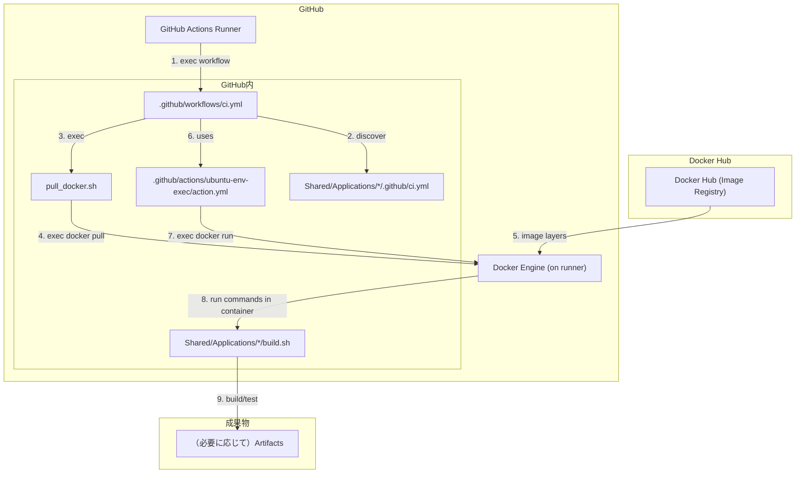

## 目的
GitHub Actions で、Docker Hub 上の開発用イメージ（amd64）を使って
リポジトリ内の各アプリが「通常ビルド」と「テスト用ビルド＋テスト実行」できることを CI の green 条件にします。

この設計は「トップ（.github/workflows）をほぼメンテしない」ことを狙っており、
アプリが増えたらそのアプリ配下に CI 定義（.yml）を 1 つ置くだけで CI 対象になります。

## 構成（全体像）

ポイント:
- スクリプト（pull_docker.sh や各アプリの build/test コマンド）は、GitHub Actions の runner 上で実行されます。
- ただしビルド/テストの本体コマンドは runner 上の Docker からコンテナを起動し、コンテナ内で実行されます。
- Docker イメージは Docker Hub から pull します。



補足:
- GitHub Actions の workflow 本体は GitHub の制約上、.github/workflows/ 配下に置く必要があります。
- 見た目（UI）上は、アプリごとに AppBuild:{App} / Test:{App} の 2 job として表示されます。

※ Python ライブラリの依存関係は、今回の「CI の流れ（pull → container run → build/test）」の理解には直接関係しないため、図からは省略しています。

## トリガー
- マージ（PR を merge）
  - 実体は「デフォルトブランチへの push」として扱われるため、push トリガーで実行されます。
- push
- pull_request
- schedule（1時間に1回）

※ schedule は混雑で数分遅れることがあり、基本はデフォルトブランチに対して動きます。

## App 側の CI 定義（各 Application に置く .yml）
アプリごとに以下のファイルを追加します。

- パス: `Shared/Applications/<App>/.github/ci.yml`

最小構成（推奨）:

```yaml
build: bash ./build.sh
test: bash ./build.sh gtest && meson test -C build --print-errorlogs
```

上書きが必要な場合のみ、以下を追加できます（通常は不要）:

```yaml
image: ksx0303x/ubuntu-env:latest
platform: linux/amd64
workdir: /home/ubuntu/Shared/Applications/<App>
```

制約（シンプル運用のため）:
- `ci.yml` はトップレベルの `key: value` のみ（ネストや複数行 YAML は使わない）
- `build:` / `test:` は 1 行コマンド（複数手順は `&&` で連結）

## Top 側の役割（ディスパッチャー）
トップの workflow（.github/workflows/ci.yml）は、以下だけを担当します。

- `Shared/Applications/*/.github/ci.yml` を自動検出
- アプリごとに 2 種類の job を起動
	- `AppBuild:{App}`: `build` を実行
	- `Test:{App}`: `test` を実行

## Docker 実行
共通の container 実行は composite action に切り出しています。

- ファイル: .github/actions/ubuntu-env-exec/action.yml

### コンテナ実行時のマウント
docker-compose と同じパス構成になるよう、以下をマウントします。

- `./Shared` → `/home/ubuntu/Shared`
- `./config` → `/usr/local/config`

## 注意（機密情報）
`config/credentials.json` や `config/token.json` は機密情報になり得ます。
CI で不要ならダミーにするか、Git にコミットしない運用にしてください。
