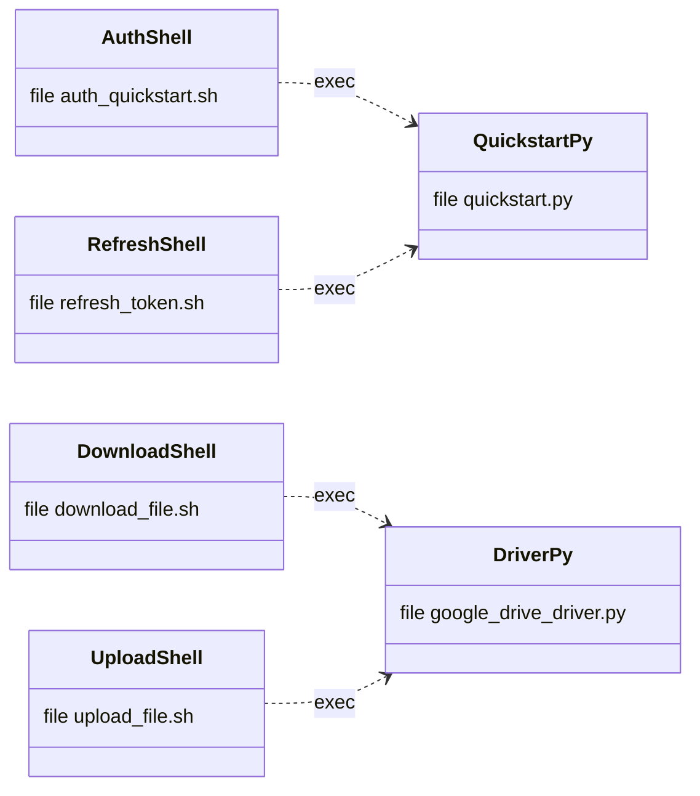
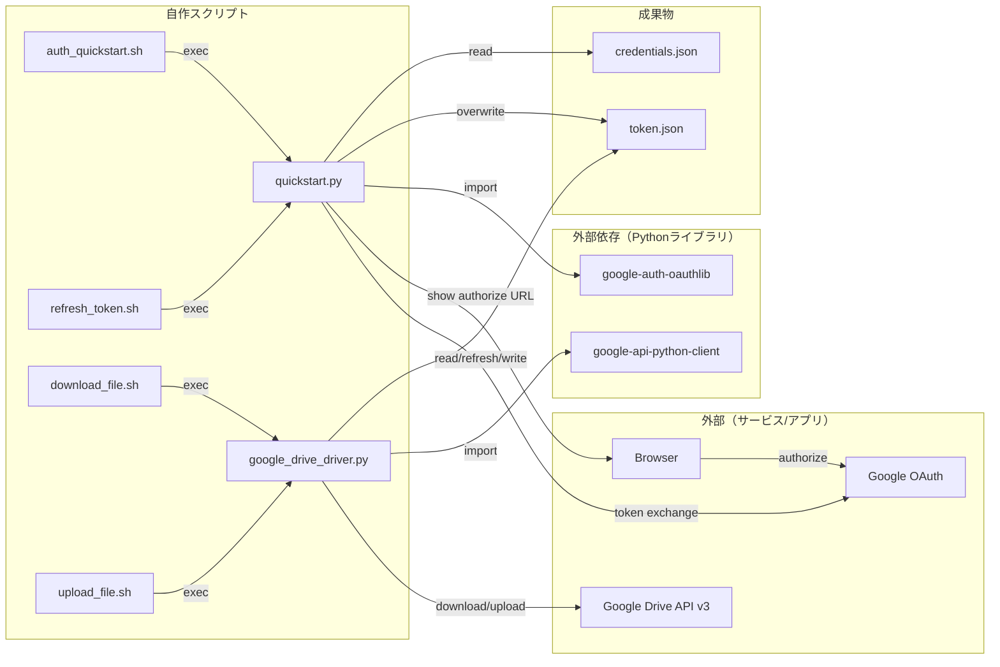
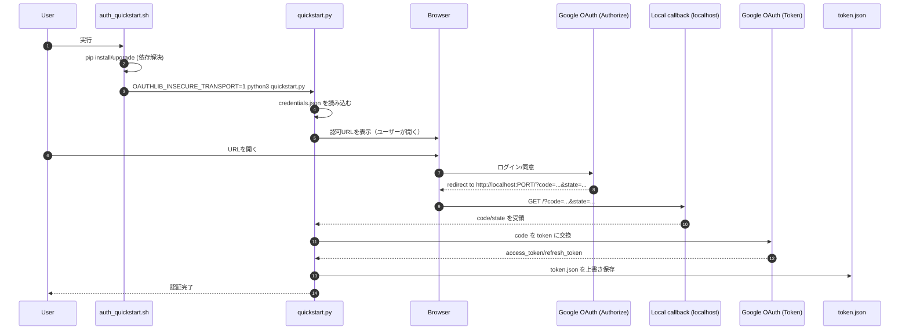
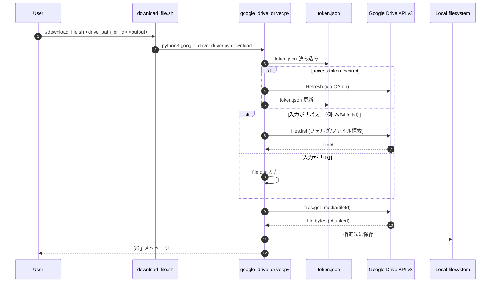
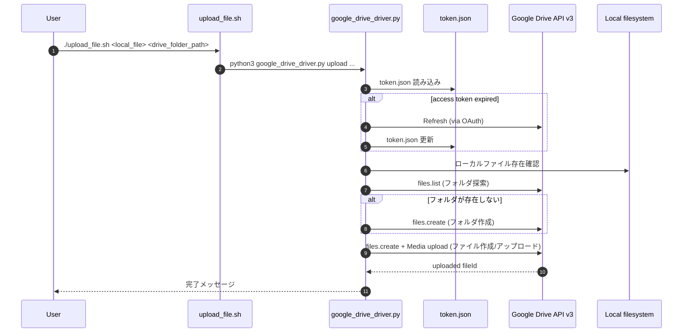

# Design

このドキュメントは、[auth_quickstart.sh](auth_quickstart.sh) / [quickstart.py](quickstart.py) / [download_file.sh](download_file.sh) / [upload_file.sh](upload_file.sh) / [google_drive_driver.py](google_drive_driver.py) の依存関係と実行フローを、Mermaid 記法で可視化したものです。

## 前提（共通）

- `python3` が利用できること
- 依存パッケージ（`pip`）
  - `google-api-python-client`
  - `google-auth-httplib2`
  - `google-auth-oauthlib`

## 主要ファイル

- `credentials.json`: OAuth クライアント（Desktop app）のクレデンシャル
- `token.json`: 認可後のトークン（アクセス/リフレッシュトークン）

## 依存関係（呼び出し関係が分かる図）

「どのスクリプトがどのスクリプトを呼び出すか」を明確にするため、
スクリプト同士は `classDiagram`、成果物/外部も含める図は subgraph で区切れる `flowchart` で整理します。

### コールグラフ（スクリプト同士のみ）

### コールグラフ（成果物/外部も含む）

## シーケンス（認証：token.json 生成）

## シーケンス（ダウンロード）

## シーケンス（アップロード）

